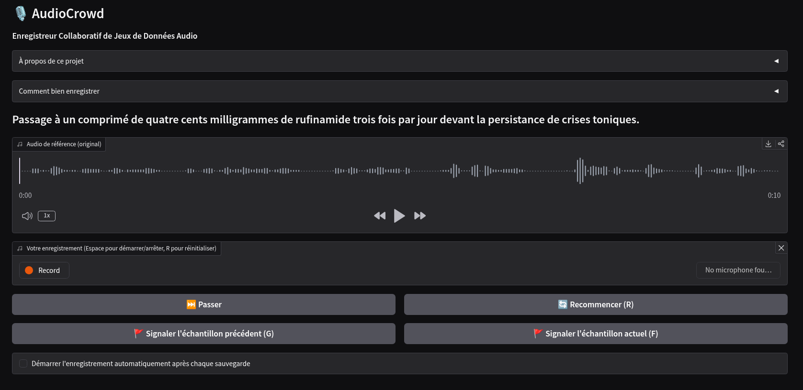

# AudioCrowd

A collaborative Gradio web UI where multiple volunteers record themselves speaking sentences to build an ASR (Automatic Speech Recognition) fine-tuning dataset.

## Features

- **Multi-user support**: volunteers authenticate via a simple CSV file and record simultaneously without conflicts
- **Automatic sentence assignment**: each user gets 5 sentences from a shared pool; new sentences are drawn automatically as recordings are completed
- **Auto-save**: recordings are saved as soon as the user stops recording -- no manual save button
- **Audio processing**: recordings are converted to 16 kHz mono WAV with silence trimming
- **NeMo-compatible output**: metadata is appended to a JSONL manifest compatible with NVIDIA NeMo
- **Flagging**: users can flag problematic samples for later review
- **Skip & discard**: skip unwanted sentences or discard mispronounced recordings
- **Bilingual UI**: English and French, auto-detected from browser or forced via config



## Keyboard shortcuts

| Key | Action |
|-----|--------|
| Space | Start/stop recording |
| R | Reset and restart recording |
| S | Skip current sentence |
| D | Discard last recording |
| F | Flag current sample (toggle) |
| G | Flag previous sample (toggle) |

## Quick start

### With uv (no Docker)

```bash
# Prepare a JSONL file with one {"text": "..."} per line
# Prepare a CSV file with username,password rows (no header)
uv run AudioCrowd.py sentences.jsonl --users-csv users.csv
```

Full options:

```bash
uv run AudioCrowd.py sentences.jsonl \
  --users-csv users.csv \
  --salt mysalt \
  --output-dir ./recordings/ \
  --output-jsonl ./output.jsonl \
  --port 7860 \
  --share \
  --lang fr
```

### With Docker

```bash
cd ./docker
cp env_file.example env_file
# Edit env_file with your settings (JSONL_PATH, USERS_CSV, etc.)
docker compose up --build
```

The app is exposed on port **7760** by default (mapped to 7860 inside the container). Mount your dataset directory and recordings are persisted to `./recordings/` on the host.

## Input format

A JSONL file with at least a `text` field per line:

```jsonl
{"text": "The patient presents with acute symptoms."}
{"text": "Administer 500mg of amoxicillin twice daily."}
```

NeMo-format lines with `audio_filepath`/`duration` fields are also accepted; only `text` is used.

## Output format

WAV files are saved as `{userid}_{uuid4[:8]}.wav` in the output directory. The JSONL manifest contains:

```jsonl
{"audio_filepath": "recordings/f3a1b2c3d4e5_a1b2c3d4.wav", "text": "The patient presents with...", "duration": 3.42, "timestamp": "2026-03-06T14:23:01+00:00", "userid": "f3a1b2c3d4e5", "sentence_index": 42}
{"audio_filepath": "recordings/f3a1b2c3d4e5_b2c3d4e5.wav", "text": "Flagged example...", "duration": 2.10, "timestamp": "2026-03-06T14:24:00+00:00", "userid": "f3a1b2c3d4e5", "sentence_index": 43, "flagged": true}
```

## Tech stack

- **Python + Gradio** -- single-file app launched via `uv run` (PEP 723 inline metadata)
- **click** for CLI argument parsing
- **loguru** for logging (stderr + `audiodataset.log`)
- **soundfile + numpy** for audio processing
- **fcntl.flock** for cross-process file locking (concurrent multi-user safety)

## License

[AGPLv3](./LICENSE)

---

*Built with [Claude Code](https://claude.ai/code).*
